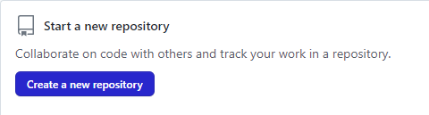
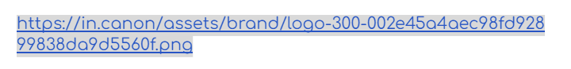

# Dom Manipulation Assignment

# 1. Webiste Name: [Dev To](https://dev.to/)

### Topics

    - Query Selctory, Inner HTML

### Sample Image


### Tasks

        Target the Top description div and change the DEV Community to <Your_Name> and description to your passion

### Output


### Solution


```javascript
document.querySelector(".side-bar .crayons-card .crayons-subtitle-2").innerHTML = "Shivanand"
document.querySelector(".side-bar .crayons-card .color-base-70").innerHTML = "I enjoy writing code and playing football"
```
---

# 2. Website Name: [Apple](https://support.apple.com/en-in)

### Task


### Fetch all the product name and store in an array

### Output

['iPhone', 'Mac', 'iPad', 'Watch', 'AirPods', 'Music', 'TV']

### Solution

```JavaScript
let productList = [];

let list = document.querySelectorAll(".as-imagegrid-item")

for(let i of list){
    productList.push(i.innerText)
}
console.log(productList);

```

```JavaScript
Output:

['iPhone\nSupport', 'Mac\nSupport', 'iPad\nSupport', 'Watch\nSupport', 'AirPods\nSupport', 'Music\nSupport', 'TV\nSupport']

```

---


# 3. Website Name: [Youtube Support](https://support.google.com/youtube/)

### Topics

    - Get Element By Id, Create Element, Create Text Node, Append Child

### Sample Image


### Tasks

     Add another FAQ 'My New FAQ' to the list

### Output


### Solution

```JavaScript
let sec = document.createElement("section");

sec.classList.add("parent")
sec.style.padding= ".875rem 3.25rem .875rem 1.75rem"
sec.style.color= "#1f1f1f"
sec.style.fontSize= "1rem"
sec.style.fontWeight= "500"
sec.style.lineHeight= "1.25rem"
sec.style.borderTop= "thin solid #a9acaa"
sec.style.margin= "0"


let faq = document.createTextNode("My New FAQ");
sec.appendChild(faq)

let appendList = document.querySelector(".main-content .article");
appendList.appendChild(sec)

```


---

# 4. Website Name: [OnePlus](https://www.oneplus.in/support)

### Topics

     Query Selector, InnerText

### Sample Image


### Tasks

      Change the contact number

### Output


### Solution

```JavaScript
let contact = document.querySelector(".customer-support .one-tel-number")
contact.innerHTML = "+91 7905200354"
```


---


## 5. Webiste Name: [Samsung](https://www.samsung.com/in/offer/online/samsung-fest/)

### Topics

       getElementById, createElement, InnerText, append, setAttribute

### Sample Image


### Tasks

     Target the main div of card and change the Button text to Check out

### Output


### Solution

```JavaScript
document.querySelector(".diwali-deals-product-sale-pro .diwali-deals-product-sale-btn").innerHTML = "Check Out"
```


---

## 6. Webiste Name: [Adidas](https://www.adidas.co.in/)

### Topics

    -   Query Selector, Event listeners, Changing Styles

### Sample Image


### Tasks

     Target the search box and on hover change thebackground color to red.

### Output


### Solution

```JavaScript
let search = document.querySelector("input");
search.addEventListener("mouseenter", ()=>{
    search.style.backgroundColor = "red";   
});

```

---

## 7. Webiste Name: [MDN Web Docs](https://developer.mozilla.org/en-US/)

### Topics

       Form, Value, Submit

### Sample Image


### Tasks

     To Search a topic in the MDN Search bar.
     First add a text to search in the search bar and then hit the submit search button to search the docs using DOM

### Output


### Solution
```javascript
document.getElementById('hp-search-input').value = "Javascript";
document.querySelector("#hp-search-form").submit()
```


---

# 8. Website Name: [Google](https://www.google.com/)

### Topics

       Remove Elements

### Sample Image


### Tasks

     Remove alternate languages from the home page languages listed

### Output


### Output

```JavaScript
let language = document.querySelector("#SIvCob");
let links = language.querySelectorAll("a");

for (let i=0; i<links.length; i=i+2) {
     language.removeChild(links[i]);
}
```


---

# 9. Website Name: [Code Wars](https://www.codewars.com/)

### Topics

       Change Font Family, Color of Text.

### Sample Image


### Tasks

    Change the font family of the text to monospace and text color to the logo’s background color.

### Output


### Soution

```JavaScript
let hero = document.querySelector(".section .container .content-width-extra-large .display-heading-1");
hero.style.fontFamily = "monospace";
hero.style.color = "red";

```


---

# 10. Webiste Name: [Freecodecamp](https://www.freecodecamp.org/)

### Topics

       querySelector, mouseover, click eventListener,  callback function, style,

### Sample Image


### Tasks

    Target the button and change background colour on mouseover

### Output


### Solution

```JavaScript
let span = document.querySelector(".btn-cta-big .login-btn-text")
span.addEventListener("mouseover", ()=>{
    span.style.backgroundColor = "red";
});
```


---

# 11. Webiste Name: [realme](https://www.realme.com/in/)

### Topics

       querySelector,style,background-image

### Sample Image


### Tasks

    change the realme logo to ineuron logo

### Output


### Solution

```Java
let backgroundImage = document.querySelector(".header .wrapper .logo .icon");
backgroundImage.style.backgroundImage = "url(image url)"
```


---

# 12. Webiste Name: [Github](https://github.com/)

### Topics

       querySelector,style,background-Color

### Sample Image


### Tasks

     change the background colour of the button to blue.

### Output



### Solution
```javascript
document.querySelector(".color-bg-default .js-braintree-encrypt .btn").style.backgroundColor = "blue"
```


---

# 13. Webiste Name: [Hackerrank](https://www.hackerrank.com/)

### Topics

       querySelector,innerHtml

### Sample Image


### Tasks

Target the top description and change “Matching developers with great companies” to ‘JSBOOTCAMP“.

### Output


### Solution

```javascript
document.querySelector(".fl-heading .fl-heading-text").innerText = "JSBOOTCAMP"
```

---

# 14. Webiste Name: [Asus](https://www.asus.com/in/)

### Topics

      querySelector,style,font-size

### Sample Image


### Tasks

       change the fontsize of “Hot Deals” to 80px

### Output


### Solution
```javascript
document.querySelector(".HotDealsAll__HotCampaignsEventsContainer__FK0V2 .HotDealsAll__Heading__2fIbe").style.fontSize = "80px"
```

---

# 15. Webiste Name: [Dell](https://www.dell.com/en-in/shop/deals/laptop-deals?gacd=10415953-9016-5761040-285981356-0&dgc=ST&gclid=Cj0KCQjwguGYBhDRARIsAHgRm4-XUDMhhVNyHXb3s1gY4ZBzORr_d9Se-buhJwy7asyUe7YdqEA11eEaAt6UEALw_wcB&gclsrc=aw.ds&nclid=BxjBlpBQsX6pjSHh-L8YYSU77EpfXRkG1AGMB5Wbeu386ykspfrPDnfx_DdFau20)

### Topics

      querySelector,style.textAlign

### Sample Image


### Tasks

       Convert the text “G15 Gaming Laptop” from left to right

### Output


### Solutions

```javascript
let products = document.querySelectorAll(".ps-title");
products[4].style.textAlign = "right";
```


---

# 16. Webiste Name: [Vercel](https://vercel.com/)

### Topics

     querySelector,innerHTMl

### Sample Image


### Tasks

      change the heading “Start with the developer” to “Start with Scratch”

### Output


### Solution

```javascript
document.querySelector(".section-title_title__VEDfK").innerHTML = "Start With Scratch"
```


---

# 17. Webiste Name: [Sony](https://www.sony.co.in/)

### Topics

    querySelector,innerHTMl

### Sample Image


### Tasks

     change the button text To current Date.

### Output


### Solutions
```javascript
document.querySelector(".btn-container .btn").innerHTML = new Date().toString();
```


---

# 18. Webiste Name: [Philips](https://www.philips.co.in/)

### Topics

     querySelector,style,backgroundcolor

### Sample Image


### Tasks

    change the background colour blue to orange

### Output


### Solution
```javascript
document.querySelector("footer").style.background = "linear-gradient(to right, #ffe259, #ffa751)"
```


---

# 19. Webiste Name: [Canon](https://in.canon/)

### Topics

          querySelector,src

### Sample Image


### Tasks

    extract the canon logo

### Output



### Solution

```javascript
let logo = document.querySelector(".navbar-brand");
let link = logo.childNodes[1].currentSrc;
console.log(link);
```


---

# 20. Website Name: [Oppo](https://www.oppo.com/in/)

### Topics

          querySelector,style,color

### Sample Image


### Tasks

      Change the description colour black to orange

### Output


### Solution 

```javascript
document.querySelector(".desc").style.color = "orange"
```
