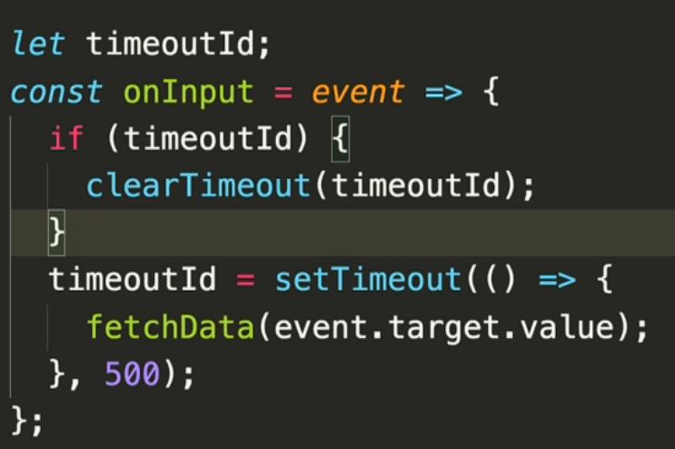

## Learnings
- params object in axios get request. 

```js  
axios.get(url, {
    params: {
      s: "search"
    }
  })
```
- input type event. 
```js
input.addEventListner("input", (e) => {
  e.target.value
})
```

- search debouncer
